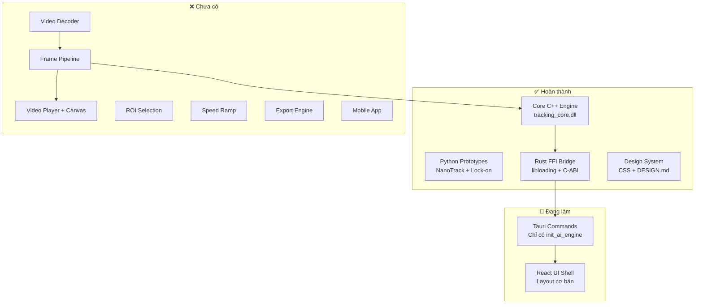

# 🎯 Tracking Video App — Báo cáo tiến độ dự án

## Tổng quan

Dự án **Lock-on Tracking + Speed Ramp** đa nền tảng, sử dụng AI NanoTrack. Kiến trúc monorepo gồm 4 module chính.

---

## 📊 Tiến độ tổng thể

| Module | Tiến độ | Trạng thái |
|--------|---------|------------|
| 🔧 **Core Engine (C++)** | ██████████ 100% | ✅ Hoàn thành |
| 🖥️ **Desktop App (Tauri + React)** | ███░░░░░░░ 30% | 🔨 Đang phát triển |
| 🐍 **Python Prototypes** | ██████████ 100% | ✅ Hoàn thành |
| 📱 **Mobile App** | ░░░░░░░░░░ 0% | ⏳ Chưa bắt đầu |
| 📝 **Documentation** | ██████████ 100% | ✅ Hoàn thành |

---

## ✅ Đã hoàn thành

### 1. Core Engine C++ → DLL
- [x] [Tracker.h](file:///c:/ae-tracking-video-app/core/src/Tracker.h) — API C++ class + C-ABI export cho FFI
- [x] [Tracker.cpp](file:///c:/ae-tracking-video-app/core/src/Tracker.cpp) — Implementation đầy đủ với OpenCV TrackerNano
- [x] [CMakeLists.txt](file:///c:/ae-tracking-video-app/core/CMakeLists.txt) — Build config cho Visual Studio 2022
- [x] C-ABI functions: `create_tracker`, `destroy_tracker`, `init_tracker`, `update_tracker`
- [x] Nhận frame data dạng byte array (RGB) từ Rust qua FFI

### 2. Rust FFI Bridge (Tauri Backend)
- [x] [tracking_bridge.rs](file:///c:/ae-tracking-video-app/desktop/src-tauri/src/tracking_bridge.rs) — Load DLL bằng `libloading`, gọi C-ABI functions
- [x] [lib.rs](file:///c:/ae-tracking-video-app/desktop/src-tauri/src/lib.rs) — Tauri command `init_ai_engine` để khởi tạo NanoTrack
- [x] `AppState` với `Mutex<Option<TrackingBridge>>` cho thread-safe state
- [x] `Drop` implementation để tự giải phóng bộ nhớ C++

### 3. Python Prototypes
- [x] [nanotrack_prototype.py](file:///c:/ae-tracking-video-app/scripts/nanotrack_prototype.py) — Demo NanoTrack AI tracking + tự động tải ONNX models
- [x] [lockon_prototype.py](file:///c:/ae-tracking-video-app/scripts/lockon_prototype.py) — Demo Lock-on effect bằng CSRT tracker
- [x] Thuật toán: EMA smoothing, translate + zoom affine transform
- [x] ONNX Models đã có sẵn trong `scripts/models/`

### 4. Desktop UI — Scaffold cơ bản
- [x] [App.tsx](file:///c:/ae-tracking-video-app/desktop/src/App.tsx) — Layout NLE cơ bản với 5 vùng:
  - Header (logo + Import/Export buttons)
  - Left Toolbar (Select, Crosshair, Settings)
  - Center Video Viewer (placeholder)
  - Right Inspector Panel (Engine selector, Smoothing slider, instructions)
  - Bottom Timeline (2 tracks: Video 1 + FX Lock-on, playhead)
- [x] [index.css](file:///c:/ae-tracking-video-app/desktop/src/index.css) — Design System CSS theo Linear aesthetic
- [x] Tauri v2 + React 19 + Vite 7 đã setup

### 5. Documentation
- [x] [README.md](file:///c:/ae-tracking-video-app/README.md) — Hướng dẫn cài đặt chi tiết, kiến trúc, troubleshooting
- [x] [DESIGN.md](file:///c:/ae-tracking-video-app/DESIGN.md) — Design System hoàn chỉnh (colors, typography, spacing, animations)
- [x] [.gitignore](file:///c:/ae-tracking-video-app/.gitignore) — Ignore DLL, ONNX, node_modules, build artifacts

---

## 🔨 Đang làm dở / Chưa hoàn thành

### Desktop App — Thiếu nhiều tính năng chính

#### Frontend (React)
- [ ] **Import Video** — Chưa có logic mở file dialog, load video vào player
- [ ] **Video Player** — Chưa render video thật, chỉ có placeholder "No video selected"
- [ ] **Video Canvas** — Chưa có `<canvas>` hoặc `<video>` element để hiển thị frame
- [ ] **ROI Selection** — Chưa có UI để vẽ bounding box chọn đối tượng tracking
- [ ] **Tracking Overlay** — Chưa render kết quả tracking (bounding box, crosshair) lên video
- [ ] **Timeline hoạt động** — Timeline hiện chỉ là static mockup, chưa tương tác được:
  - Chưa kéo playhead
  - Chưa scrub timeline
  - Chưa zoom in/out timeline
  - Chưa hiển thị keyframes từ tracking data
- [ ] **Speed Ramp** — Chưa có UI/logic cho tính năng thay đổi tốc độ video
- [ ] **Export** — Chưa có logic xuất video đã xử lý

#### Backend (Rust/Tauri)
- [ ] **Video decoding** — Chưa có logic đọc video frame-by-frame (cần thêm crate như `ffmpeg` hoặc `gstreamer`)
- [ ] **Frame pipeline** — Chưa truyền frame data từ video → C++ tracker → React UI
- [ ] **Tauri commands thiếu**:
  - `open_video` — Mở file dialog, load video
  - `get_frame` — Lấy frame tại timestamp
  - `start_tracking` — Bắt đầu tracking với ROI
  - `export_video` — Xuất video với effects
- [ ] **Tracking session management** — Chưa quản lý nhiều tracking sessions

### Mobile App
- [ ] Chưa chọn framework (React Native hay Flutter)
- [ ] Chưa có bất kỳ code nào, chỉ có file [README.md](file:///c:/ae-tracking-video-app/mobile/README.md) placeholder

---

## 🏗️ Kiến trúc hiện tại

---

## 🎯 Đề xuất bước tiếp theo (theo thứ tự ưu tiên)

1. **Video Pipeline** — Thêm video decoding vào Rust backend (sử dụng `ffmpeg-next` hoặc gọi qua DLL). Đây là nền tảng cho mọi tính năng còn lại.
2. **Video Player** — Render video lên `<canvas>` trong React, có play/pause/seek.
3. **ROI Selection** — Cho phép user vẽ bounding box lên video canvas.
4. **Tracking Integration** — Kết nối full pipeline: React → Tauri → C++ → kết quả → React overlay.
5. **Timeline tương tác** — Kéo playhead, hiển thị tracking keyframes.
6. **Speed Ramp** — UI curve editor + logic thay đổi tốc độ.
7. **Export** — Xuất video với tracking effect + speed ramp.
8. **Mobile** — Sau khi Desktop hoàn thiện.

> [!IMPORTANT]
> Dự án đã xây dựng xong **nền tảng AI tracking** (C++ core + Rust bridge + Python prototype). Phần lớn công việc còn lại là **Desktop UI + Video Pipeline** — kết nối mọi thứ lại với nhau thành ứng dụng hoàn chỉnh.
