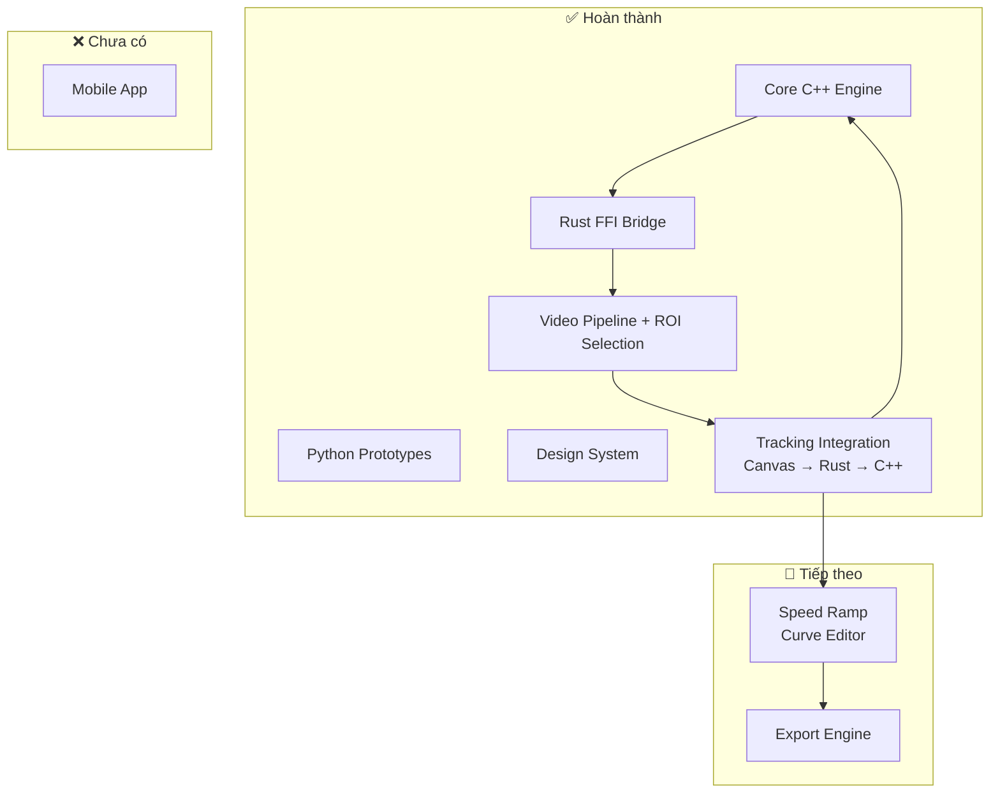

# 🎯 Tracking Video App — Báo cáo tiến độ dự án

## Tổng quan

Dự án **Lock-on Tracking + Speed Ramp** đa nền tảng, sử dụng AI NanoTrack. Kiến trúc monorepo gồm 4 module chính.

---

## 📊 Tiến độ tổng thể

| Module | Tiến độ | Trạng thái |
|--------|---------|------------|
| 🔧 **Core Engine (C++)** | ██████████ 100% | ✅ Hoàn thành |
| 🖥️ **Desktop App (Tauri + React)** | ███████░░░ 70% | 🔨 Đang phát triển |
| 🐍 **Python Prototypes** | ██████████ 100% | ✅ Hoàn thành |
| 📱 **Mobile App** | ░░░░░░░░░░ 0% | ⏳ Chưa bắt đầu |
| 📝 **Documentation** | ██████████ 100% | ✅ Hoàn thành |

---

## ✅ Đã hoàn thành

### 1. Core Engine C++ → DLL
- [x] [Tracker.h](file:///c:/ae-tracking-video-app/core/src/Tracker.h) — API C++ class + C-ABI export cho FFI
- [x] [Tracker.cpp](file:///c:/ae-tracking-video-app/core/src/Tracker.cpp) — Implementation đầy đủ với OpenCV TrackerNano
- [x] [CMakeLists.txt](file:///c:/ae-tracking-video-app/core/CMakeLists.txt) — Build config cho Visual Studio 2022
- [x] C-ABI functions: `create_tracker`, `destroy_tracker`, `init_tracker`, `update_tracker`
- [x] Nhận frame data dạng byte array (RGB) từ Rust qua FFI

### 2. Rust FFI Bridge (Tauri Backend)
- [x] [tracking_bridge.rs](file:///c:/ae-tracking-video-app/desktop/src-tauri/src/tracking_bridge.rs) — Load DLL bằng `libloading`, gọi C-ABI functions
- [x] [lib.rs](file:///c:/ae-tracking-video-app/desktop/src-tauri/src/lib.rs) — Tauri commands: `init_ai_engine`, `get_video_metadata`, `start_tracking`, `process_frame`
- [x] `AppState` với `Mutex<Option<TrackingBridge>>` cho thread-safe state
- [x] Convert RGBA -> RGB trực tiếp trong Rust để tối ưu hiệu suất
- [x] Plugin: `tauri-plugin-dialog`, `tauri-plugin-fs`, `tauri-plugin-opener`

### 3. Python Prototypes
- [x] [nanotrack_prototype.py](file:///c:/ae-tracking-video-app/scripts/nanotrack_prototype.py) — Demo NanoTrack AI tracking + tự động tải ONNX models
- [x] [lockon_prototype.py](file:///c:/ae-tracking-video-app/scripts/lockon_prototype.py) — Demo Lock-on effect bằng CSRT tracker
- [x] Thuật toán: EMA smoothing, translate + zoom affine transform
- [x] ONNX Models đã có sẵn trong `scripts/models/`

### 4. Desktop UI — Video Pipeline + Tracking ✨ NEW
- [x] **Video Pipeline**: Import Video, ẩn thẻ `<video>`, render lên `<canvas>`, điều khiển playback (play/pause/seek)
- [x] **ROI Selection**: Công cụ vẽ bounding box, layer overlay tương tác, auto resize/scale tọa độ
- [x] **Tracking Integration**: Trích xuất frame RGBA liên tục bằng `requestAnimationFrame`, gửi qua IPC, render crosshair (Target) bám theo tọa độ tracking
- [x] **UI & Inspector**: Thiết kế Linear-style, metadata hiển thị, thao tác bằng phím tắt (V/C/Space/Esc)
- [x] **Timeline**: Thanh scrubber kéo thời gian, hiển thị label video clip

### 5. Documentation
- [x] [README.md](file:///c:/ae-tracking-video-app/README.md) — Hướng dẫn cài đặt chi tiết, kiến trúc, troubleshooting
- [x] [DESIGN.md](file:///c:/ae-tracking-video-app/DESIGN.md) — Design System hoàn chỉnh (colors, typography, spacing, animations)

---

## 🔨 Đang làm dở / Chưa hoàn thành

### Desktop App — Tính năng còn thiếu

#### Frontend (React)
- [ ] **Keyframe display** — Chưa hiển thị tracking keyframes (đường di chuyển của đối tượng) trực tiếp lên Timeline
- [ ] **Speed Ramp** — Chưa có UI Curve Editor để vẽ đường cong tốc độ video ← **TIẾP THEO**
- [ ] **Export** — Chưa có logic xuất video đã xử lý + effects

#### Backend (Rust/Tauri)
- [ ] **Export Video** — Tauri command để ghi video đã áp dụng tracking effect và speed ramp
- [ ] **Tracking session management** — Cải thiện nếu muốn lưu/load nhiều project

### Mobile App
- [ ] Chưa chọn framework (React Native hay Flutter)
- [ ] Chưa có bất kỳ code nào

---

## 🏗️ Kiến trúc hiện tại

---

## 🎯 Đề xuất bước tiếp theo (theo thứ tự ưu tiên)

1. ~~**Video Pipeline**~~ ✅ DONE
2. ~~**Video Player**~~ ✅ DONE
3. ~~**ROI Selection**~~ ✅ DONE
4. ~~**Tracking Integration**~~ ✅ DONE
5. **Speed Ramp** — Xây dựng UI Curve Editor (biểu đồ tốc độ) dưới dạng track thứ 3 trên timeline để điều khiển `playbackRate`. ← **ĐANG CHUẨN BỊ**
6. **Export** — Xuất video với tracking effect + speed ramp.
7. **Mobile** — Sau khi Desktop hoàn thiện.

> [!IMPORTANT]
> **Core Tracking Loop** đã hoàn thiện! Dữ liệu video đi từ React Canvas -> Tauri IPC -> Rust RGBA/RGB Convert -> C++ NanoTrack Tracker, trả về kết quả và render crosshair mượt mà. 
> Bước tiếp theo là xây dựng **Speed Ramp Curve Editor**.
