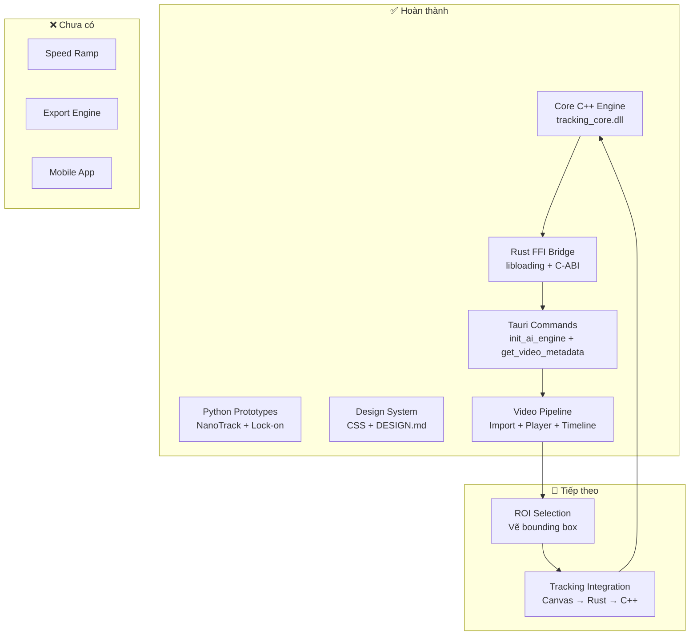

# 🎯 Tracking Video App — Báo cáo tiến độ dự án

## Tổng quan

Dự án **Lock-on Tracking + Speed Ramp** đa nền tảng, sử dụng AI NanoTrack. Kiến trúc monorepo gồm 4 module chính.

---

## 📊 Tiến độ tổng thể

| Module | Tiến độ | Trạng thái |
|--------|---------|------------|
| 🔧 **Core Engine (C++)** | ██████████ 100% | ✅ Hoàn thành |
| 🖥️ **Desktop App (Tauri + React)** | █████░░░░░ 50% | 🔨 Đang phát triển |
| 🐍 **Python Prototypes** | ██████████ 100% | ✅ Hoàn thành |
| 📱 **Mobile App** | ░░░░░░░░░░ 0% | ⏳ Chưa bắt đầu |
| 📝 **Documentation** | ██████████ 100% | ✅ Hoàn thành |

---

## ✅ Đã hoàn thành

### 1. Core Engine C++ → DLL
- [x] [Tracker.h](file:///c:/ae-tracking-video-app/core/src/Tracker.h) — API C++ class + C-ABI export cho FFI
- [x] [Tracker.cpp](file:///c:/ae-tracking-video-app/core/src/Tracker.cpp) — Implementation đầy đủ với OpenCV TrackerNano
- [x] [CMakeLists.txt](file:///c:/ae-tracking-video-app/core/CMakeLists.txt) — Build config cho Visual Studio 2022
- [x] C-ABI functions: `create_tracker`, `destroy_tracker`, `init_tracker`, `update_tracker`
- [x] Nhận frame data dạng byte array (RGB) từ Rust qua FFI

### 2. Rust FFI Bridge (Tauri Backend)
- [x] [tracking_bridge.rs](file:///c:/ae-tracking-video-app/desktop/src-tauri/src/tracking_bridge.rs) — Load DLL bằng `libloading`, gọi C-ABI functions
- [x] [lib.rs](file:///c:/ae-tracking-video-app/desktop/src-tauri/src/lib.rs) — Tauri commands: `init_ai_engine`, `get_video_metadata`
- [x] `AppState` với `Mutex<Option<TrackingBridge>>` cho thread-safe state
- [x] `Drop` implementation để tự giải phóng bộ nhớ C++
- [x] Plugin: `tauri-plugin-dialog`, `tauri-plugin-fs`, `tauri-plugin-opener`

### 3. Python Prototypes
- [x] [nanotrack_prototype.py](file:///c:/ae-tracking-video-app/scripts/nanotrack_prototype.py) — Demo NanoTrack AI tracking + tự động tải ONNX models
- [x] [lockon_prototype.py](file:///c:/ae-tracking-video-app/scripts/lockon_prototype.py) — Demo Lock-on effect bằng CSRT tracker
- [x] Thuật toán: EMA smoothing, translate + zoom affine transform
- [x] ONNX Models đã có sẵn trong `scripts/models/`

### 4. Desktop UI — Video Pipeline + Player ✨ NEW
- [x] [useVideoPlayer.ts](file:///c:/ae-tracking-video-app/desktop/src/hooks/useVideoPlayer.ts) — Custom hook quản lý toàn bộ video state
- [x] [VideoPlayer.tsx](file:///c:/ae-tracking-video-app/desktop/src/components/VideoPlayer.tsx) — Hidden `<video>` + Canvas rendering
- [x] [PlayerControls.tsx](file:///c:/ae-tracking-video-app/desktop/src/components/PlayerControls.tsx) — Play/Pause, Stop, timecode HH:MM:SS:FF, speed, volume
- [x] [Timeline.tsx](file:///c:/ae-tracking-video-app/desktop/src/components/Timeline.tsx) — Draggable playhead, time ruler, zoom, click-to-seek
- [x] [App.tsx](file:///c:/ae-tracking-video-app/desktop/src/App.tsx) — Layout NLE hoàn chỉnh với 5 vùng tích hợp
- [x] [App.css](file:///c:/ae-tracking-video-app/desktop/src/App.css) — CSS hoàn chỉnh theo Linear dark aesthetic
- [x] Import Video qua Tauri file dialog + asset protocol
- [x] Inspector panel hiển thị metadata (tên file, resolution, size, duration)
- [x] `getFrameData()` sẵn sàng cho tracking integration

### 5. Documentation
- [x] [README.md](file:///c:/ae-tracking-video-app/README.md) — Hướng dẫn cài đặt chi tiết, kiến trúc, troubleshooting
- [x] [DESIGN.md](file:///c:/ae-tracking-video-app/DESIGN.md) — Design System hoàn chỉnh (colors, typography, spacing, animations)

---

## 🔨 Đang làm dở / Chưa hoàn thành

### Desktop App — Tính năng còn thiếu

#### Frontend (React)
- [ ] **ROI Selection** — Chưa có UI để vẽ bounding box chọn đối tượng tracking ← **TIẾP THEO**
- [ ] **Tracking Overlay** — Chưa render kết quả tracking (bounding box, crosshair) lên video
- [ ] **Keyframe display** — Chưa hiển thị keyframes từ tracking data trên timeline
- [ ] **Speed Ramp** — Chưa có UI/logic cho tính năng thay đổi tốc độ video
- [ ] **Export** — Chưa có logic xuất video đã xử lý

#### Backend (Rust/Tauri)
- [ ] **Frame pipeline** — Chưa truyền frame data từ canvas → Rust → C++ tracker
- [ ] **Tauri commands thiếu**:
  - `start_tracking` — Bắt đầu tracking với ROI
  - `export_video` — Xuất video với effects
- [ ] **Tracking session management** — Chưa quản lý nhiều tracking sessions

### Mobile App
- [ ] Chưa chọn framework (React Native hay Flutter)
- [ ] Chưa có bất kỳ code nào

---

## 🏗️ Kiến trúc hiện tại

---

## 🎯 Đề xuất bước tiếp theo (theo thứ tự ưu tiên)

1. ~~**Video Pipeline** — Thêm video decoding~~ ✅ DONE
2. ~~**Video Player** — Render video lên canvas~~ ✅ DONE
3. **ROI Selection** — Cho phép user vẽ bounding box lên video canvas ← **ĐANG LÀM**
4. **Tracking Integration** — Kết nối full pipeline: React → Tauri → C++ → kết quả → React overlay
5. **Speed Ramp** — UI curve editor + logic thay đổi tốc độ
6. **Export** — Xuất video với tracking effect + speed ramp
7. **Mobile** — Sau khi Desktop hoàn thiện

> [!IMPORTANT]
> Video Pipeline đã hoàn thành! Bước tiếp theo là **ROI Selection** để user có thể chọn đối tượng cần tracking trên video.
